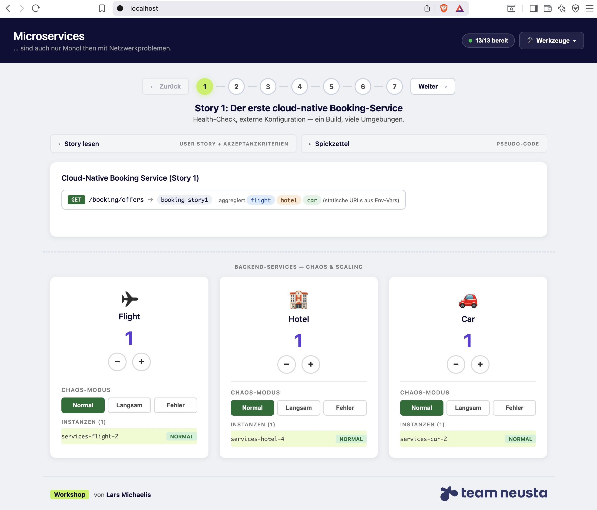

# Workshop-Vorbereitung

Diese Anleitung beschreibt, wie du das Repo auscheckst, die Umgebung startest und mit dem Workshop loslegst.

## Voraussetzungen

- **Git**
- **Docker** inkl. Docker Compose
- **IDE / Editor** nach Wahl (optional, nur wenn du die Stories selbst implementieren willst)
- Eigene Sprache/Framework deiner Wahl, in der du den Booking-Service umsetzen möchtest (Java/Spring Boot, Quarkus, Go, Node.js, ...)

## 1. Repository klonen

```bash
git clone https://github.com/larmic/workshop_microservices.git
cd workshop_microservices/services
```

Alle weiteren Befehle werden aus dem Verzeichnis `services/` ausgeführt.

## 2. Umgebung starten

Es gibt zwei Wege, die Workshop-Umgebung hochzufahren — beide bringen die gleichen Container ans Laufen (Flight, Hotel, Car, Booking-Referenzlösungen, Traefik, Consul, Swagger UI, Dashboard).

### Variante A — Images von Docker Hub ziehen (empfohlen für Teilnehmer)

Schnell und ohne lokalen Build:

```bash
make docker-up-hub
```

Im Hintergrund: `docker compose ... pull` lädt fertige Images von Docker Hub (`larmic/workshop-microservices-*`), dann `docker compose ... up`.

### Variante B — Images lokal bauen

Wenn du Änderungen am Code oder an den Dockerfiles vornimmst, baust du die Images lokal:

```bash
make docker-up
```

Das entspricht `docker compose ... up --build` über alle drei Compose-Dateien.

### Ohne Makefile

Falls `make` nicht verfügbar ist, gehen beide Varianten auch direkt:

```bash
# Variante A (Docker Hub)
docker compose -f docker-compose.yml -f docker-compose.infra.yml -f docker-compose.reference.yml pull
docker compose -f docker-compose.yml -f docker-compose.infra.yml -f docker-compose.reference.yml up

# Variante B (lokal bauen)
docker compose -f docker-compose.yml -f docker-compose.infra.yml -f docker-compose.reference.yml up --build
```

Alle weiteren Make-Targets siehst du mit `make help`.

## 3. Dashboard öffnen

Das **Dashboard** ist das zentrale Tool für den Workshop. Hier startest, stoppst und skalierst du Services, siehst Health-Status und kommst in einem Klick zu den anderen Tools.

> **<http://localhost>**



## 4. Weitere URLs

| Tool              | URL                              | Zweck                                |
|-------------------|----------------------------------|--------------------------------------|
| Dashboard         | <http://localhost>               | Workshop-Steuerzentrale              |
| Swagger UI        | <http://localhost/api>           | API-Dokumentation aller Services     |
| Consul UI         | <http://localhost/consul>        | Service Discovery & Health           |
| Traefik Dashboard | <http://localhost:8080>          | Routing & Reverse-Proxy-Monitoring   |

Schneller Health-Check vom Terminal:

```bash
curl http://localhost/api/flight/health
curl http://localhost/api/hotel/health
curl http://localhost/api/car/health
```

## 5. Los geht's

Dein Arbeitsplatz ist eingerichtet. Starte mit [Story 1: Der erste cloud-native Booking-Service](stories/story-01-cloud-native-booking-service.md).

---

## Trainer-Aufgabe: Feedback einsammeln

Feedback läuft über **GitHub Discussions** im Repo `larmic/workshop_microservices`. Der Link ist auf der Feedback-Slide (Slide 2) sowie als prominenter Button in der Dashboard-Kopfleiste hinterlegt.

Einmalige Einrichtung:

1. Im Repo: Settings → Features → ✓ Discussions
2. Kategorie *Workshop Feedback* anlegen (Format „Open-ended")

Pro Workshop-Run optional ein vorbereiteter Sammel-Thread:

- **Titel:** z.B. `Feedback Kickoff — YYYY-MM-DD`
- **Body:** Datum und die sechs Fragen aus der Disclaimer-Slide (roter Faden, Patterns, Zeitrahmen, Beispiele, Dashboard, Sonstiges)

Falls das Repo umzieht, die URL in `services/slides/chapters/02-feedback.md` und in `services/dashboard/static/index.html` (Feedback-Button) anpassen.
